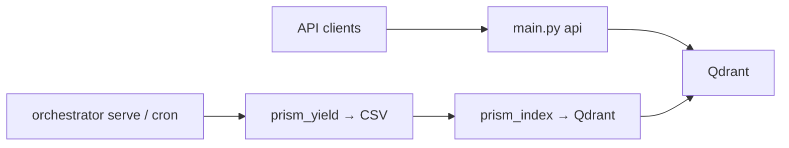

# Scheduler setup (Phase 2)

How to run **unattended** scrape jobs on the schedule defined in [`orchestrator.yaml`](../orchestrator.yaml) (timezone `Asia/Manila`).

Two options:

| Option | Best for |
|--------|----------|
| **A — OS scheduler** | Production server/VM; survives reboot via cron or Task Scheduler |
| **B — `orchestrator serve`** | Dev machines, quick staging, or when you prefer one Python process |

Both call the same logic: `run --due` (cron match + browser lock + FlareSolverr preflight for OpenSTAT).

---

## Prerequisites

1. Install dependencies:

   ```bash
   uv sync --extra orchestrator --extra openstat --extra browser --extra api
   uv run scrapling install   # if running browser-heavy jobs
   ```

   The **`api` extra** is required for the `prism_index` job (Qdrant indexer) and if you run the HTTP API locally.

2. Configure `.env` (database, FlareSolverr URL, scraper toggles as needed).

3. Verify jobs:

   ```bash
   uv run python -m src.orchestrator list
   ```

---

## Option A — Linux cron (single entry)

Poll every minute; the orchestrator runs only jobs whose cron matches “now”:

```cron
* * * * * cd /path/to/source-scraper && /path/to/source-scraper/.venv/bin/python -m src.orchestrator run --due >> /path/to/source-scraper/data/logs/orchestrator-cron.log 2>&1
```

Create `data/logs/` if you use a log file (or drop the redirect).

### Per-job cron (optional)

If you prefer one cron line per source instead of `--due`:

```cron
0 2 * * 0  cd /path/to/source-scraper && .venv/bin/python -m src.orchestrator run philrice
0 3 * * 0  cd /path/to/source-scraper && .venv/bin/python -m src.orchestrator run philrice_news
0 2 1,15 * * cd /path/to/source-scraper && .venv/bin/python -m src.orchestrator run pinoyrice
0 2 * * 1  cd /path/to/source-scraper && .venv/bin/python -m src.orchestrator run irri
0 4 1-7 * 0 cd /path/to/source-scraper && .venv/bin/python -m src.orchestrator run openstat
0 5 1-7 * 0 cd /path/to/source-scraper && .venv/bin/python -m src.orchestrator run prism_scrape
0 6 1-7 * 0 cd /path/to/source-scraper && .venv/bin/python -m src.orchestrator run prism_yield
```

All times are **PH time** (`Asia/Manila`), same as `orchestrator.yaml`.

---

## Option A — Windows Task Scheduler

1. Open **Task Scheduler** → Create Task.
2. **Triggers:** repeat every **1 minute**, indefinitely.
3. **Actions:**
   - Program: path to `python.exe` (or `uv run` wrapper)
   - Arguments: `-m src.orchestrator run --due`
   - **Start in:** project root (folder containing `orchestrator.yaml`)
4. Run whether user is logged on or not (if the machine is a server).

Example with `uv`:

- Program: `C:\Users\You\.local\bin\uv.exe`
- Arguments: `run python -m src.orchestrator run --due`
- Start in: `C:\path\to\source-scraper`

---

## Option B — `orchestrator serve` (APScheduler)

Long-running process; polls `run --due` every 60 seconds (configurable):

```bash
uv run python -m src.orchestrator serve
uv run python -m src.orchestrator serve --interval 60
```

Stop with **Ctrl+C**. On Linux, run under **systemd** or **supervisor** if you want auto-restart.

**When to use `serve` vs OS cron**

- **`serve`:** simpler on Windows dev boxes; one process shows live Rich output.
- **OS cron / Task Scheduler:** better for production (no dependency on a long-lived Python process; standard ops tooling).

---

## Browser lock (P2.4)

At most **one browser-heavy job** runs at a time (Playwright / heavy browser load).

- Lock file: `data/checkpoints/orchestrator_browser.lock`
- If another browser job is active → **skip** (yellow log), not a hard failure
- Stale locks (dead PID) are cleared automatically
- Non-browser jobs (e.g. `prism_yield`, `prism_index`) are not locked

If you see unexpected skips, check for a stuck lock file and verify no orphan Python scraper is running.

---

## FlareSolverr + OpenSTAT (P2.7)

OpenSTAT needs FlareSolverr for Cloudflare bypass.

1. Start FlareSolverr (from project root):

   ```bash
   docker compose up -d flaresolverr
   ```

2. Set in `.env`:

   ```env
   FLARESOLVERR_URL=http://localhost:8191
   ```

3. Before each **openstat** orchestrator run, the preflight will:
   - Health-check FlareSolverr (`sessions.create`)
   - If down, run `docker compose up -d flaresolverr` and wait up to 60s
   - Fail the job with a clear message if still unreachable

---

## Qdrant + `prism_index` (API data refresh)

The **HTTP API** reads indexed yield data from Qdrant — it does not scrape. After each monthly `prism_yield` export, run **`prism_index`** (scheduled 07:00 PH, one hour after yield at 06:00) to upsert the CSV into Qdrant.

1. Deploy or start Qdrant separately (for example, Qdrant Cloud or a standalone Qdrant container/VM). Qdrant is **not** a service in this repository's `docker-compose.yml`.

2. Set in `.env` for local Python runs:

   ```env
   QDRANT_URL=http://localhost:6333
   ```

   When running the API or scheduler through Docker Compose, set the container-reachable URL:

   ```env
   DOCKER_QDRANT_URL=http://host.docker.internal:6333
   ```

3. Before each **prism_index** run, preflight will:
   - Health-check Qdrant (`GET /healthz`)
   - Fail the job with a clear message if the external Qdrant endpoint is unreachable

Manual index:

```bash
uv run python -m src.orchestrator run prism_index
# or
uv run python main.py index --collections all
```

---

## OpenSTAT farmgate prices + `openstat_index`

After the monthly **`openstat`** scrape (04:00 PH), **`openstat_index`** (05:00 PH) reads `data/openstat_processed/openstat_table.csv` and upserts into:

| Collection | Purpose |
|------------|---------|
| `openstat_price_records` | Structured list/summary/export (`GET /v1/prices`) |
| `openstat_price_knowledge` | Hybrid search (`POST /v1/prices/search`) |

OpenSTAT is **not** in `agri_corpus_rag` — use `/v1/prices/*` for farmgate price queries.

**Checkpoint:** `data/checkpoints/openstat_checkpoint.json` stores **`completed_urls`** (normalized PSA page URLs), not CSV row indices. Each row in `openstat_table.csv` may include `Source URL` for safe resume merges.

**Automated runs (orchestrator):** `openstat` sets `RESUME_CHECKPOINT=false` — every scheduled run is a **full monthly refresh**. You do not need to manually re-run after deploys. The scraper also **writes CSV after each completed URL** so a mid-run crash (deploy, timeout) still keeps partial data + Wasabi backup; the **next month’s** scheduled run starts fresh (checkpoint cleared at start). Optional: `RESUME_CHECKPOINT=true` only if you add extra retry triggers in the same month — not required for the default cron.

```bash
uv run python -m src.orchestrator run openstat
uv run python -m src.orchestrator run openstat_index
# or
uv run python main.py index-prices --collections all
```

Optional env overrides:

```env
OPENSTAT_CSV_SOURCE_RELPATH=openstat_processed/openstat_table.csv
QDRANT_PRICE_RECORDS_COLLECTION=openstat_price_records
QDRANT_PRICE_KNOWLEDGE_COLLECTION=openstat_price_knowledge
```

---

## Unified RAG corpus + `corpus_rag_index` (P3.8)

After monthly scrapes, **`corpus_rag_index`** (scheduled 08:00 PH, one hour after `prism_index`) reads five narrative CPT JSONL files and upserts hybrid embeddings into **`agri_corpus_rag`**:

| Source ID | JSONL path |
|-----------|------------|
| `philrice` | `data/philrice_processed/philrice_corpus.jsonl` |
| `philrice_news` | `data/philrice_news_processed/philrice_news_corpus.jsonl` |
| `pinoyrice` | `data/pinoyrice_processed/pinoyrice_corpus.jsonl` |
| `irri` | `data/irri_processed/irri_corpus.jsonl` |
| `prism_browser` | `data/prism_processed/prism_corpus_chunked.jsonl` (optional) |

Yield CSV and OpenSTAT prices use separate Qdrant collections via `prism_index` and `openstat_index`.

Set in `.env` (optional overrides):

```env
QDRANT_URL=http://localhost:6333
CORPUS_RAG_COLLECTION=agri_corpus_rag
```

Manual index:

```bash
uv run python -m src.indexing.corpus_rag_indexer
uv run python -m src.orchestrator run corpus_rag_index
```

Search (API must be running with `--extra api`):

```bash
curl -X POST http://localhost:8000/v1/corpus/search \
  -H "Content-Type: application/json" \
  -d '{"query":"rice variety", "limit": 5}'
```

Index stats are written to `data/runs/<run_id>/manifest.json` under `corpus_index`.

---

## Running the API alongside the orchestrator

These are **separate long-running processes** on the same host (or split across machines):

| Process | Role | Command |
|---------|------|---------|
| **Qdrant** | External vector DB for API/indexers | Qdrant Cloud, standalone container, or separately managed service |
| **API** | Serves `/v1/*` queries | `uv run python main.py api --port 8000` |
| **Orchestrator** | Scheduled scrapes + index | `uv run python -m src.orchestrator serve` or OS cron → `run --due` |



**Local dev (3 terminals):**

```bash
# Terminal 1 — local scraper helper
docker compose up -d flaresolverr

# Terminal 2 — API (always-on)
uv sync --extra api
uv run python main.py api --reload --port 8000

# Terminal 3 — scheduler (optional)
uv run python -m src.orchestrator serve
```

OpenStat / PhilRice corpora (JSONL under `data/`) are indexed into **`agri_corpus_rag`** and searchable via **`POST /v1/corpus/search`**. Yield tabular data remains on the PRiSM yield endpoints and `/v1/knowledge/search`.

---

## Troubleshooting

| Symptom | What to do |
|---------|------------|
| `No jobs due at this time` | Normal between cron slots; use `list` to see next run |
| `Skipped (browser lock held by …)` | Wait for the other job or remove stale lock if PID is dead |
| OpenSTAT preflight failed | `docker compose logs flaresolverr`; check port 8191 |
| Qdrant preflight failed | Check the external Qdrant service, port 6333, and `QDRANT_URL` / `DOCKER_QDRANT_URL` |
| API shows stale yield data | Confirm `prism_index` ran after `prism_yield`; check `GET /v1/index/status` |
| Job exceeded timeout (yellow) | Increase `timeout_minutes` in `orchestrator.yaml` for that job |
| Corpus validation failed | See `data/runs/<run_id>/validation_report.json`; run `validate_corpus --source <id> --quality` manually |
| `docker compose` not found | Install Docker Desktop; or start FlareSolverr manually |

---

## Observability (Phase 3)

Every orchestrator job run writes artifacts under `data/runs/<run_id>/`:

| File | Purpose |
|------|---------|
| `manifest.json` | Job status, duration, output paths, record counts, warnings |
| `validation_report.json` | Corpus validation results (or `{ "skipped": true }` for non-corpus jobs) |

Structured JSON logs append to `data/logs/orchestrator.jsonl` (enable/disable with `ORCHESTRATOR_LOG_JSON`).

### Validation env

```env
ORCHESTRATOR_VALIDATE_QUALITY=true   # default; set false for format-only checks
VALIDATE_MIN_TEXT_CHARS=100
VALIDATE_MAX_EMPTY_LINE_PCT=5
```

### Failure alerts (optional — free channels)

P3.6 needs **no paid webhook or SMTP**. Pick one or combine:

| Channel | Env | Cost | Best for |
|---------|-----|------|----------|
| **Local file** (default) | `ALERT_LOCAL_FILE=true` | Free | VPS/laptop — read `data/alerts/last_failure.json` |
| **Telegram** | `ALERT_TELEGRAM_BOT_TOKEN` + `ALERT_TELEGRAM_CHAT_ID` | Free | Phone push via Telegram app |
| **ntfy** | `ALERT_NTFY_TOPIC` | Free | Phone push via [ntfy app](https://ntfy.sh) |
| **Discord** | `ALERT_DISCORD_WEBHOOK_URL` | Free | Team channel (free Discord server) |

Legacy optional: `ALERT_WEBHOOK_URL`, Slack, SMTP email.

#### Minimum setup (local only — zero signup)

```env
ALERT_ENABLED=true
ALERT_LOCAL_FILE=true
```

On failure, writes `data/alerts/last_failure.json` and `data/alerts/<run_id>.json`.

#### Telegram (recommended free push)

1. Telegram → message **@BotFather** → `/newbot` → copy **bot token**
2. Message your new bot once, then open in browser:  
   `https://api.telegram.org/bot<TOKEN>/getUpdates`  
   Copy `"chat":{"id": ...}` → that is `ALERT_TELEGRAM_CHAT_ID`
3. `.env`:

```env
ALERT_ENABLED=true
ALERT_TELEGRAM_BOT_TOKEN=123456789:ABCdefGHI...
ALERT_TELEGRAM_CHAT_ID=987654321
```

#### ntfy (free phone notification)

1. Install **ntfy** app (Android/iOS) or use https://ntfy.sh
2. Pick a **secret topic** name (hard to guess), e.g. `crich-source-scraper-x7k2`
3. Subscribe to that topic in the app
4. `.env`:

```env
ALERT_ENABLED=true
ALERT_NTFY_TOPIC=crich-source-scraper-x7k2
# ALERT_NTFY_SERVER=https://ntfy.sh   # default; self-host if you prefer
```

#### Discord (free server webhook)

1. Discord channel → Edit → Integrations → Webhooks → New Webhook → Copy URL
2. `.env`:

```env
ALERT_ENABLED=true
ALERT_DISCORD_WEBHOOK_URL=https://discord.com/api/webhooks/...
```

```env
ALERT_ON_TIMEOUT=false   # set true to alert on timeout warnings
```

Alerts fire on job failure, validation failure, or preflight failure.

Cron can rely on structured logs instead of shell redirect:

```cron
* * * * * cd /path/to/source-scraper && .venv/bin/python -m src.orchestrator run --due
```

---

## Stream mode + corpus refresh (`*_FRESH_CORPUS`)

PhilRice PDF, PhilRice News, PinoyRice, and IRRI default to **stream mode**: CPT records append to `*_corpus.jsonl` during scrape; raw `.txt`/PDF files are deleted after ingest. On disk you keep **checkpoint + corpus** only.

| Source | Stream env | Delete raw | Fresh corpus env |
|--------|------------|------------|------------------|
| PhilRice PDF | `PHILRICE_STREAM_PROCESS=true` | `PHILRICE_DELETE_PDF_AFTER_CLEAN` | `PHILRICE_FRESH_CORPUS=true` |
| PhilRice News | `PHILRICE_NEWS_STREAM_PROCESS=true` | `PHILRICE_NEWS_DELETE_TXT_AFTER_PROCESS` | `PHILRICE_NEWS_FRESH_CORPUS=true` |
| PinoyRice | `PINOYRICE_STREAM_PROCESS=true` | `PINOYRICE_DELETE_PDF_AFTER_CLEAN` | `PINOYRICE_FRESH_CORPUS=true` |
| IRRI | `IRRI_STREAM_PROCESS=true` | `IRRI_DELETE_TXT_AFTER_PROCESS`, `IRRI_DELETE_PDF_AFTER_CLEAN` | `IRRI_FRESH_CORPUS=true` |

**When to use `*_FRESH_CORPUS=true` (one-time):**

- Reset checkpoint and want a clean JSONL before a full re-scrape
- Corrupted or duplicate-heavy `*_corpus.jsonl` after a bad run

**Normal weekly runs:** leave `*_FRESH_CORPUS` unset (append + checkpoint incremental). Re-index only: run `corpus_rag_index` without re-scraping.

PhilRice News leftovers: if you still have legacy `.txt` in `data/philrice_news/` from batch runs, the orchestrator job runs `run(leftovers_only=True)` after scrape to ingest them with `url`/`title` from checkpoint, then delete the files.

---

## Wasabi per-job backup + restore

After each successful scrape job, the orchestrator uploads mapped artifacts to Wasabi:

- `corpus-data/latest/` and `corpus-data/backup/` — rolling current + previous upload
- `corpus-data/history/YYYY-MM-DD/` — dated snapshots (keeps last **2** by default)
- `Checkpoint/latest/`, `Checkpoint/backup/`, `Checkpoint/history/YYYY-MM-DD/` — same pattern
- `qdrant-data/latest|backup|history/YYYY-MM-DD/` — Qdrant collection `.snapshot` files (after index jobs + monthly sync)

Upload failures **fail the job** by default (`WASABI_BACKUP_FAIL_JOB=true`). Set `WASABI_BACKUP_FAIL_JOB=false` only if you want warnings without failing the scrape/index run.

```env
WASABI_ACCESS_KEY=
WASABI_SECRET_KEY=
WASABI_BUCKET=agent-scraper
WASABI_REGION=ap-southeast-1
WASABI_ENDPOINT=https://s3.ap-southeast-1.wasabisys.com
WASABI_CORPUS_PREFIX=corpus-data/
WASABI_CHECKPOINT_PREFIX=Checkpoint/
WASABI_QDRANT_PREFIX=qdrant-data/
WASABI_DATED_RETENTION=2
WASABI_BACKUP_FAIL_JOB=true
```

Example dated path: `corpus-data/history/2026-06-16/irri_corpus.jsonl`

**When backups run**

| Trigger | Corpus + checkpoints | Qdrant snapshots |
|---------|---------------------|------------------|
| After each scrape job (irri, philrice, …) | yes | no |
| After `corpus_rag_index`, `prism_index`, `openstat_index` | no | yes |
| Monthly `corpus_backup_wasabi` (1st Monday 09:00 PH) | all mapped jobs | all existing collections |

Restore from Wasabi (disaster recovery or new machine):

```bash
# List available dated snapshots
uv run python -m src.storage.wasabi_restore --list-dates
uv run python -m src.storage.wasabi_restore --list-dates --job irri

# One job (latest)
uv run python -m src.storage.wasabi_restore --job irri

# All mapped jobs (skips missing remote objects per job)
uv run python -m src.storage.wasabi_restore --all

# Previous rolling backup
uv run python -m src.storage.wasabi_restore --job irri --tier backup

# Specific dated snapshot
uv run python -m src.storage.wasabi_restore --job irri --tier dated --date 2026-06-09

# Restore corpus + rebuild Qdrant from JSONL/CSV (no snapshot needed)
uv run python -m src.storage.wasabi_restore --all --reindex

# Restore Qdrant vectors directly from snapshots (faster than re-index)
uv run python -m src.storage.wasabi_restore --qdrant --tier latest
uv run python -m src.storage.wasabi_restore --qdrant --tier dated --date 2026-06-09
```

Mapping: `src/orchestrator/wasabi_backup.py` (`JOB_WASABI_ARTIFACTS`). Qdrant collections: `src/storage/qdrant_wasabi_backup.py`.

---

## Production delivery — release bundle (Phase 5, optional)

Planned monthly jobs (after weekend scrapes). **Disabled by default** in `orchestrator.yaml`.

| Job ID | Schedule (PH) | Purpose |
|--------|---------------|---------|
| `corpus_release` | 1st Monday 08:00 | Build `data/releases/YYYY-MM-DD/` + `RELEASE_NOTES.md` |
| `corpus_backup_wasabi` | 1st Monday 09:00 | Full sync: all corpus/checkpoints + Qdrant snapshots |

```powershell
uv run python -m src.orchestrator run corpus_backup_wasabi
```

Per-job Wasabi upload (after each successful job) is the primary backup path; `corpus_backup_wasabi` is optional redundancy.

Runners: `src/orchestrator/runners/release_jobs.py`.

---

## Related docs

- [`AUTOMATION_ROADMAP.md`](../AUTOMATION_ROADMAP.md) — full phasing and scrape schedule table
- [`orchestrator.yaml`](../orchestrator.yaml) — cron and env overrides per job
- [`docs/api.md`](api.md) — API endpoints and env vars
- [`AGENTS.md`](../AGENTS.md) — standard dev commands
