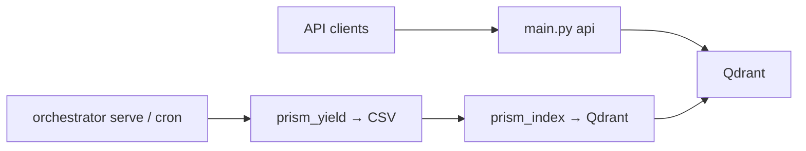

# Scheduler setup (Phase 2)

How to run **unattended** scrape jobs on the schedule defined in [`orchestrator.yaml`](../orchestrator.yaml) (timezone `Asia/Manila`).

Two options:

| Option | Best for |
|--------|----------|
| **A — OS scheduler** | Production server/VM; survives reboot via cron or Task Scheduler |
| **B — `orchestrator serve`** | Dev machines, quick staging, or when you prefer one Python process |

Both call the same logic: `run --due` (cron match + browser lock + FlareSolverr preflight for OpenSTAT).

---

## Prerequisites

1. Install dependencies:

   ```bash
   uv sync --extra orchestrator --extra openstat --extra browser --extra api
   uv run scrapling install   # if running browser-heavy jobs
   ```

   The **`api` extra** is required for the `prism_index` job (Qdrant indexer) and if you run the HTTP API locally.

2. Configure `.env` (database, FlareSolverr URL, scraper toggles as needed).

3. Verify jobs:

   ```bash
   uv run python -m src.orchestrator list
   ```

---

## Option A — Linux cron (single entry)

Poll every minute; the orchestrator runs only jobs whose cron matches “now”:

```cron
* * * * * cd /path/to/source-scraper && /path/to/source-scraper/.venv/bin/python -m src.orchestrator run --due >> /path/to/source-scraper/data/logs/orchestrator-cron.log 2>&1
```

Create `data/logs/` if you use a log file (or drop the redirect).

### Per-job cron (optional)

If you prefer one cron line per source instead of `--due`:

```cron
0 2 * * 0  cd /path/to/source-scraper && .venv/bin/python -m src.orchestrator run philrice
0 3 * * 0  cd /path/to/source-scraper && .venv/bin/python -m src.orchestrator run philrice_news
0 2 1,15 * * cd /path/to/source-scraper && .venv/bin/python -m src.orchestrator run pinoyrice
0 2 * * 1  cd /path/to/source-scraper && .venv/bin/python -m src.orchestrator run irri
0 4 1-7 * 0 cd /path/to/source-scraper && .venv/bin/python -m src.orchestrator run openstat
0 5 1-7 * 0 cd /path/to/source-scraper && .venv/bin/python -m src.orchestrator run prism_scrape
0 6 1-7 * 0 cd /path/to/source-scraper && .venv/bin/python -m src.orchestrator run prism_yield
```

All times are **PH time** (`Asia/Manila`), same as `orchestrator.yaml`.

---

## Option A — Windows Task Scheduler

1. Open **Task Scheduler** → Create Task.
2. **Triggers:** repeat every **1 minute**, indefinitely.
3. **Actions:**
   - Program: path to `python.exe` (or `uv run` wrapper)
   - Arguments: `-m src.orchestrator run --due`
   - **Start in:** project root (folder containing `orchestrator.yaml`)
4. Run whether user is logged on or not (if the machine is a server).

Example with `uv`:

- Program: `C:\Users\You\.local\bin\uv.exe`
- Arguments: `run python -m src.orchestrator run --due`
- Start in: `C:\path\to\source-scraper`

---

## Option B — `orchestrator serve` (APScheduler)

Long-running process; polls `run --due` every 60 seconds (configurable):

```bash
uv run python -m src.orchestrator serve
uv run python -m src.orchestrator serve --interval 60
```

Stop with **Ctrl+C**. On Linux, run under **systemd** or **supervisor** if you want auto-restart.

**When to use `serve` vs OS cron**

- **`serve`:** simpler on Windows dev boxes; one process shows live Rich output.
- **OS cron / Task Scheduler:** better for production (no dependency on a long-lived Python process; standard ops tooling).

---

## Browser lock (P2.4)

At most **one browser-heavy job** runs at a time (Playwright / heavy browser load).

- Lock file: `data/checkpoints/orchestrator_browser.lock`
- If another browser job is active → **skip** (yellow log), not a hard failure
- Stale locks (dead PID) are cleared automatically
- Non-browser jobs (e.g. `prism_yield`, `prism_index`) are not locked

If you see unexpected skips, check for a stuck lock file and verify no orphan Python scraper is running.

---

## FlareSolverr + OpenSTAT (P2.7)

OpenSTAT needs FlareSolverr for Cloudflare bypass.

1. Start FlareSolverr (from project root):

   ```bash
   docker compose up -d flaresolverr
   ```

2. Set in `.env`:

   ```env
   FLARESOLVERR_URL=http://localhost:8191
   ```

3. Before each **openstat** orchestrator run, the preflight will:
   - Health-check FlareSolverr (`sessions.create`)
   - If down, run `docker compose up -d flaresolverr` and wait up to 60s
   - Fail the job with a clear message if still unreachable

---

## Qdrant + `prism_index` (API data refresh)

The **HTTP API** reads indexed yield data from Qdrant — it does not scrape. After each monthly `prism_yield` export, run **`prism_index`** (scheduled 07:00 PH, one hour after yield at 06:00) to upsert the CSV into Qdrant.

1. Start Qdrant (from project root):

   ```bash
   docker compose up -d qdrant
   ```

2. Set in `.env`:

   ```env
   QDRANT_URL=http://localhost:6333
   ```

3. Before each **prism_index** run, preflight will:
   - Health-check Qdrant (`GET /healthz`)
   - If down, run `docker compose up -d qdrant` and wait up to 60s
   - Fail the job if still unreachable

Manual index:

```bash
uv run python -m src.orchestrator run prism_index
# or
uv run python main.py index --collections all
```

---

## Running the API alongside the orchestrator

These are **separate long-running processes** on the same host (or split across machines):

| Process | Role | Command |
|---------|------|---------|
| **Qdrant** | Vector DB for API | `docker compose up -d qdrant` |
| **API** | Serves `/v1/*` queries | `uv run python main.py api --port 8000` |
| **Orchestrator** | Scheduled scrapes + index | `uv run python -m src.orchestrator serve` or OS cron → `run --due` |



**Local dev (3 terminals):**

```bash
# Terminal 1 — infrastructure
docker compose up -d

# Terminal 2 — API (always-on)
uv sync --extra api
uv run python main.py api --reload --port 8000

# Terminal 3 — scheduler (optional)
uv run python -m src.orchestrator serve
```

OpenStat / PhilRice corpora (JSONL under `data/`) are **not** served by the PRiSM yield API — they feed separate training/curation pipelines.

---

## Troubleshooting

| Symptom | What to do |
|---------|------------|
| `No jobs due at this time` | Normal between cron slots; use `list` to see next run |
| `Skipped (browser lock held by …)` | Wait for the other job or remove stale lock if PID is dead |
| OpenSTAT preflight failed | `docker compose logs flaresolverr`; check port 8191 |
| Qdrant preflight failed | `docker compose logs qdrant`; check port 6333 and `QDRANT_URL` |
| API shows stale yield data | Confirm `prism_index` ran after `prism_yield`; check `GET /v1/index/status` |
| Job exceeded timeout (yellow) | Increase `timeout_minutes` in `orchestrator.yaml` for that job |
| `docker compose` not found | Install Docker Desktop; or start FlareSolverr manually |

---

## Related docs

- [`AUTOMATION_ROADMAP.md`](../AUTOMATION_ROADMAP.md) — full phasing and scrape schedule table
- [`orchestrator.yaml`](../orchestrator.yaml) — cron and env overrides per job
- [`docs/api.md`](api.md) — API endpoints and env vars
- [`AGENTS.md`](../AGENTS.md) — standard dev commands
