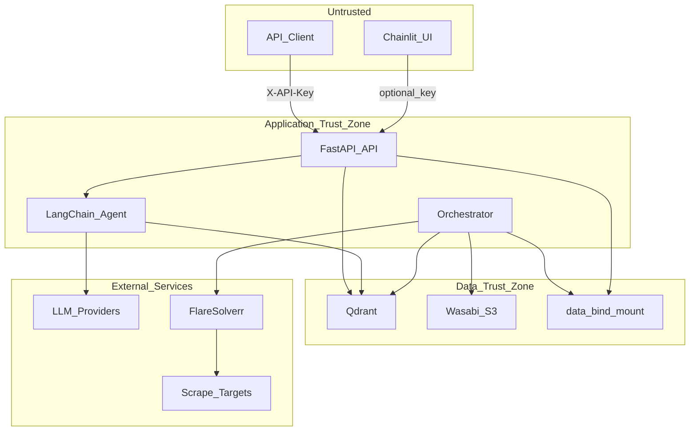

# Security Review — Source Scraper

Last updated: 2026-06-30  
Scope: API (`src/api/`), agent (`src/agent/`), orchestrator, scrapers, Docker deployment, storage (Qdrant/Wasabi).

---

## 1. Executive Summary

Source Scraper has a **solid baseline**: API-key scopes, read-only agent tools, Pydantic validation, CORS off by default, secrets gitignored, and no shell injection in reviewed paths.

The **highest risks** are misconfiguration and exposure:

1. Auth bypass via `API_AUTH_DISABLED=true` (grants admin to everyone).
2. Unauthenticated or weakly protected Qdrant on deploy hosts.
3. Agent endpoint cost/abuse (LLM + unbounded Qdrant scroll).
4. Chainlit UI without authentication when exposed publicly.
5. FlareSolverr and shared `.env` blast radius in Docker.

This document tracks findings, mitigations, and a **four-phase hardening roadmap** with loop validation after each phase.

---

## 2. Architecture & Trust Boundaries

**Trust assumptions**

- API keys and JWT secrets are known only to trusted clients/operators.
- Qdrant and FlareSolverr are reachable only on private networks in production.
- Scraped corpus content is semi-trusted (indirect prompt-injection risk remains).
- LLM providers are third-party data processors.

---

## 3. Findings Register

| ID | Severity | Status | Area | Finding | Mitigation / Phase |
|----|----------|--------|------|---------|-------------------|
| C1 | Critical | **Fixed** | API auth | `API_AUTH_DISABLED=true` grants admin scope | Startup guard via `APP_ENV` + `ALLOW_AUTH_DISABLED` — Phase 1 |
| C2 | Critical | **Mitigated** | Qdrant deploy | Standalone compose had no API key; ports now localhost-bound | `QDRANT__SERVICE__API_KEY` + `127.0.0.1` bind — Phase 1 |
| H1 | High | **Fixed** | Agent API | Public-tier + default `agent_enabled` → LLM abuse | `require_agent` (admin/agent keys); `AGENT_ALLOW_PUBLIC` opt-in — Phase 2 |
| H2 | High | **Fixed** | JWT | Parsed on agent route but unused | Pass scope/user to orchestrator for `user_type` gating — Phase 2 |
| H3 | High | **Fixed** | Agent tools | Unbounded `summarize_*` Qdrant scroll | `AGENT_SUMMARIZE_MAX_ROWS` cap — Phase 2 |
| H4 | High | **Mitigated** | Chainlit | No auth, `allow_origins=*`, file upload on | Disable upload; restrict origins; prod docs — Phase 3 |
| H5 | High | **Fixed** | Docker | FlareSolverr host port `8191` in deploy compose | Removed public port mapping — Phase 1 |
| H6 | High | **Mitigated** | Docker | Shared `.env` for API + scheduler | `docker-compose.prod.yml` split env files — Phase 3 |
| M1 | Medium | **Fixed** | API | OpenAPI docs default on | Document `API_DOCS_ENABLED=false` in `.env.example` — Phase 1 |
| M2 | Medium | **Fixed** | Rate limits | `RATE_LIMIT_*` env vars unused | Wired to route decorators — Phase 2 |
| M3 | Medium | **Fixed** | Rate limits | Raw API key in limiter key func | Use `hash_key()` — Phase 2 |
| M4 | Medium | **Fixed** | Health | Unauthenticated, no rate limit | `RATE_LIMIT_HEALTH` — Phase 2 |
| M5 | Medium | **Fixed** | Agent | Client `user_type: admin` not tied to auth | Gated by admin scope / JWT role — Phase 2 |
| M6 | Medium | **Fixed** | Scraper | SSRF via operator env URLs → FlareSolverr/browser | `src/utils/url_policy.py` allowlist — Phase 3 |
| M7 | Medium | **Fixed** | Alerts | Full error object in webhook payloads | `ALERT_INCLUDE_TRACEBACK` default false — Phase 3 |
| M8 | Medium | **Mitigated** | Containers | Root user, unpinned images | Non-root `USER`, pinned image tags — Phase 4 |
| M9 | Medium | **Fixed** | Git | `.env.*` not gitignored | Extended `.gitignore` — Phase 1 |
| M10 | Medium | **Fixed** | Schemas | `CorpusSearchRequest.source_ids` unbounded | `max_length=10` — Phase 2 |
| L1 | Low | Open | Errors | Exception class names in `details` | Accept / proxy strips in prod |
| L2 | Low | Open | Export | `Content-Disposition` from filter values | Sanitize filenames — future |
| L3 | Low | **Fixed** | Tests | Auth disabled by default in test helpers | `test_api_auth.py` + `APP_ENV=test` — Phase 2 |
| L4 | Low | **Fixed** | API | No security headers middleware | `SecurityHeadersMiddleware` — Phase 3 |

---

## 4. Validated vs Potential vs Accepted

### Confirmed (validated in source)

- C1, H1–H3, H5, M2–M5, M6 mechanism, M10 — traced to specific files during review.
- Read-only agent tools: no scrape/index/write from `/v1/agent/chat`.
- No `pickle` / `eval` / shell interpolation in reviewed agent and orchestrator paths.

### Potential (deployment-dependent)

- TLS termination, firewall rules, Wasabi IAM scope, Qdrant public exposure on VPS.
- LLM prompt injection from user message or poisoned corpus (mitigate, not eliminate).

### Accepted risks

- `/v1/health` remains unauthenticated by design (rate-limited); collection names aid ops debugging.
- Full JWT RBAC deferred until product defines tenants/roles.
- Chainlit remains a dev/demo UI unless operators enable Chainlit auth separately.

---

## 5. Positive Controls

| Control | Location |
|---------|----------|
| API key scopes (public/admin) | `src/api/auth.py` |
| API keys hashed for logging | `hash_key()` in `src/api/auth.py` |
| Pydantic `extra="forbid"` on search/agent bodies | `src/api/schemas.py` |
| CORS disabled when `API_CORS_ORIGINS` empty | `src/api/app.py` |
| Rate limits on data/search/export/agent routes | `src/api/routes/*` |
| `.env` gitignored; `.dockerignore` blocks secrets | `.gitignore`, `.dockerignore` |
| Read-only agent tools (Qdrant query only) | `src/agent/tools.py` |
| Checkpoint-safe scraper orchestration | `src/orchestrator/` |
| Wasabi/Qdrant credentials via env only | `src/storage/` |

---

## 6. Phase Implementation Roadmap

### Phase 1 — Production Safety Gates

- Startup guards for `API_AUTH_DISABLED` and missing API keys.
- Qdrant compose API key support and `127.0.0.1` port bind.
- Remove FlareSolverr public port in deploy compose.
- `.env.example`, `.gitignore` for `.env.*`.

### Phase 2 — API & Agent Abuse Controls

- `require_agent` dependency; summarize row caps; wired rate limits.
- `hash_key()` in rate limiter; health rate limit; corpus `source_ids` cap.
- `user_type` privilege gating; `tests/test_api_auth.py`.

### Phase 3 — UI, Scraper SSRF, Alerts

- Chainlit: disable file upload, restrict origins.
- URL policy for PRiSM/OpenSTAT/FlareSolverr.
- Alert payload redaction; security headers; `docker-compose.prod.yml` env split.
- HTTPS-only source links in Chainlit UI.

### Phase 4 — Container Hardening & Assurance

- Pin Docker image tags; non-root `USER` in Dockerfile.
- `Dockerfile.api` slim variant; security regression tests.
- Deploy doc security checklist; quarterly re-review section.

---

## 7. Loop Validation Log

| Date | Phase | Checks | Result |
|------|-------|--------|--------|
| 2026-06-30 | 0 | Initial code review (API, agent, Docker, scraper) | Findings registered |
| 2026-06-30 | 1–4 | Implementation + `unittest discover` (239 tests) | All phases implemented; tests pass |

**Per-phase checklist**

1. Re-read changed files.
2. `uv run python -m unittest discover -s tests -p "test_*.py" -v`
3. `docker compose -f docker-compose.qdrant.yml config` (if compose changed)
4. Update finding statuses in Section 3.

---

## 8. Production Deployment Checklist

- [ ] `APP_ENV=production`
- [ ] `API_AUTH_DISABLED=false`
- [ ] `API_KEYS_PUBLIC` and `API_KEYS_ADMIN` set (high-entropy, rotated)
- [ ] `API_DOCS_ENABLED=false`
- [ ] `AGENT_ENABLED=true` only if needed; use `API_KEYS_AGENT` or admin keys (`AGENT_ALLOW_PUBLIC=false`)
- [ ] `QDRANT_API_KEY` set on Qdrant server **and** app (`QDRANT__SERVICE__API_KEY` + `QDRANT_API_KEY`)
- [ ] Qdrant ports not on public internet (bind `127.0.0.1` or VPC only)
- [ ] FlareSolverr not exposed on host port (internal Docker network only)
- [ ] TLS in front of API port 8000
- [ ] Chainlit not public without Chainlit password/OAuth
- [ ] `WASABI_ENABLED` explicit; least-privilege bucket policy
- [ ] `ALERT_INCLUDE_TRACEBACK=false` for Discord/Telegram/webhooks
- [ ] Split `.env.shared` / `.env.api` / `.env.scheduler` per `docker-compose.prod.yml`

---

## 9. References

- [docs/deploy.md](deploy.md) — API deployment
- [docs/AGENT_API.md](AGENT_API.md) — Agent endpoint contract
- [docs/AGENT_UI.md](AGENT_UI.md) — Chainlit UI
- [docs/SCHEDULER_SETUP.md](SCHEDULER_SETUP.md) — Orchestrator and alerts
- [Qdrant security](https://qdrant.tech/documentation/guides/security/)

---

## 10. Quarterly Re-Review Checklist

- Rotate API keys, Qdrant API key, Wasabi keys, alert webhook URLs.
- Run Wasabi + Qdrant snapshot restore drill.
- Re-scan for new endpoints without auth/rate limits.
- Review `APP_ENV` and `API_AUTH_DISABLED` on all hosts.
- Audit Chainlit exposure and CORS settings.
- Update pinned Docker image digests.
