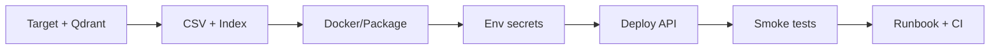

# PRiSM API — Deployment Plan

Deployment guide for the **versioned HTTP API** (`/v1/`). This document covers FastAPI plus externally deployed Qdrant.

For endpoint reference and environment variables, see [api.md](api.md).

---

## Task: Deploy the PRiSM API (FastAPI + External Qdrant)

### Description

Put the versioned HTTP API into production so consumers can query the indexed PRiSM yield dataset through Qdrant. The service covers structured listing, metadata, deterministic summaries, hybrid semantic search, and admin export/index endpoints.

**Runtime stack (as implemented in this repo):**

| Component | Details |
| --- | --- |
| App | FastAPI + uvicorn (`uv run python main.py api`, `uvicorn main:app`, or the repository Docker image) |
| Vector DB | External Qdrant (`prism_yield_records`, `prism_yield_knowledge`) |
| Data source | `data/prism_processed/prism_yield_export.csv` (from the separate yield export job) |
| Security | `X-API-Key` (public vs admin scopes), rate limits, optional CORS |

**Definition of done (high level):**

- Stable public API URL
- `GET /v1/health` returns healthy when Qdrant is reachable
- Production API keys configured
- Yield CSV indexed into Qdrant
- Documented process to refresh data when the CSV changes

---

## Subtasks

### 1. Choose deployment target and topology

- Decide where the **API process** runs (VPS, Railway, Render, Fly.io, internal VM, etc.).
- Decide **self-hosted Qdrant** (Docker on the same host/VPC) vs **Qdrant Cloud** (`QDRANT_URL` + `QDRANT_API_KEY`).
- Sketch networking: API → Qdrant (prefer private/VPC); do not expose Qdrant publicly unless required.

### 2. Prepare the production data pipeline (separate from API deploy)

- Ensure an up-to-date **`prism_yield_export.csv`** (via `PRISM_JOB=export_yield_csv` / existing yield scraper).
- Upload or mount the CSV where the **indexer** runs (not necessarily on the API container if indexing is a one-off job).
- Run the indexer against production Qdrant:

  ```bash
  uv sync --extra api
  uv run python main.py index --collections all
  ```

- Verify with `GET /v1/index/status` (admin key): correct row counts and collection names.

### 3. Containerize or package the API

The repository includes a Dockerfile and `docker-compose.yml` for the API endpoint, optional Chainlit UI (`--profile ui`), and scraper/orchestrator automation.

- The image uses Python 3.12 and installs the API, orchestrator, agent, **ui (Chainlit)**, browser, and OpenStat extras.
- The default container command serves the API with uvicorn:

  ```bash
  uvicorn main:app --host 0.0.0.0 --port ${PORT:-8000}
  ```

- Compose services:
  - `api`: serves `/v1/*` on port 8000.
  - `chainlit` profile (`ui`): demo chat UI on port 8001 → calls `http://api:8000/v1/agent/chat`.
  - `scheduler` profile: runs `python -m src.orchestrator serve` for scheduled scraper, validation, indexing, backup, and alert jobs.
  - `flaresolverr`: local helper for OpenSTAT scraper bypass only; the API does not depend on it.
- Qdrant is external. Set `QDRANT_URL` for direct runs or `DOCKER_QDRANT_URL` for compose so containers receive the correct `QDRANT_URL`.
- Account for **embedding model download** on first index/start (FastEmbed models from settings).

Verify with Chainlit (local or Hostinger, after Qdrant + index):

```bash
# Local
docker compose --profile ui up -d --build

# Deploy/staging
docker compose -f docker-compose.deploy.yml --profile ui up -d --build

# Production-shaped (Chainlit bound to 127.0.0.1:8001 only)
docker compose -f docker-compose.deploy.yml -f docker-compose.prod.yml --profile ui up -d --build
```

Set `AGENT_UI_API_KEY` in `.env` / `.env.api` to an agent-scoped key when auth is enabled. Open `http://127.0.0.1:8001` (or SSH tunnel to Hostinger). Do **not** publish Chainlit publicly without Chainlit password/OAuth.

### 4. Configure production environment variables

Minimum set (see [api.md](api.md) for full reference):

| Area | Variables |
| --- | --- |
| Auth | `API_KEYS_PUBLIC`, `API_KEYS_ADMIN`, `API_AUTH_DISABLED=false` |
| Qdrant | `QDRANT_URL`, `QDRANT_API_KEY` (if hosted), `QDRANT_TIMEOUT_SECONDS` |
| Ops | `API_LOG_JSON=true`, `API_LOG_LEVEL`, `API_DOCS_ENABLED` (optionally `false` in prod) |
| CORS | `API_CORS_ORIGINS` if a web frontend will call the API |
| Limits | `RATE_LIMIT_READ`, `RATE_LIMIT_SEARCH`, `RATE_LIMIT_EXPORT`, `EXPORT_MAX_ROWS` |
| Data | `CSV_SOURCE_RELPATH` if the CSV is mounted elsewhere |

Store secrets in the platform secret manager; do not commit `.env`.

Example production `.env` (placeholders only):

```env
API_AUTH_DISABLED=false
API_KEYS_PUBLIC=your-public-key
API_KEYS_ADMIN=your-admin-key
API_LOG_JSON=true
API_DOCS_ENABLED=false

QDRANT_URL=https://your-cluster.qdrant.io
QDRANT_API_KEY=your-qdrant-key

API_CORS_ORIGINS=https://your-frontend.example
```

### 5. Deploy the API service

- Deploy the container/process bound to the service port (e.g. 8000).
- Deploy or provision Qdrant separately and keep it reachable from the API/indexer environment. Prefer private networking or Qdrant Cloud with an API key.
- Health check: `GET /v1/health` (200 when Qdrant is OK; 503 + `Retry-After` when Qdrant is down — expected).
- Terminate TLS at a reverse proxy or the platform (nginx, Caddy, load balancer).
- Optionally restrict or disable `/v1/docs` on the public internet (`API_DOCS_ENABLED=false` or allowlist).

### 6. Post-deploy verification (smoke + contract)

**Public tier** (`X-API-Key` with public scope):

```bash
curl -H "X-API-Key: $PUBLIC_KEY" https://api.example.com/v1/health
curl -H "X-API-Key: $PUBLIC_KEY" "https://api.example.com/v1/yield?limit=5"
curl -H "X-API-Key: $PUBLIC_KEY" https://api.example.com/v1/yield/metadata
curl -X POST -H "X-API-Key: $PUBLIC_KEY" -H "Content-Type: application/json" \
  -d '{"query":"Bangued Abra 2018","limit":5}' \
  https://api.example.com/v1/knowledge/search
```

**Admin tier:**

```bash
curl -H "X-API-Key: $ADMIN_KEY" https://api.example.com/v1/index/status
curl -H "X-API-Key: $ADMIN_KEY" \
  "https://api.example.com/v1/yield/export?format=csv&region=CAR&limit=100"
```

**Negative checks:**

- No key → 401
- Wrong key → 403
- Export rate limit → 429

**Optional retrieval eval:**

```bash
uv run python -m tests.eval.run_eval --base-url https://api.example.com
```

### 7. Operational runbook (refresh and monitoring)

**CSV refresh flow:**

1. Run yield export to produce a new `prism_yield_export.csv`.
2. Re-index: `uv run python main.py index --collections all`
3. Refresh metadata cache: `POST /v1/index/refresh-metadata` (admin key).

**Monitoring:**

- Health endpoint (`/v1/health`)
- Structured logs (`API_LOG_JSON=true`)
- Qdrant uptime and latency on search/export

**Backup:**

- Qdrant snapshots / cloud backups
- Keep the CSV under `data/prism_processed/`

**Incidents:**

- If health returns 503, check Qdrant connectivity and `QDRANT_*` environment variables.

### 8. CI/CD and documentation (optional)

- Pipeline: unit tests (`uv run python -m unittest discover -s tests -p "test_*.py" -v`), optional lint, build image, deploy staging → production.
- Keep this file and [api.md](api.md) in sync when env vars or endpoints change.

---

## Suggested order



1. Target + Qdrant  
2. CSV + index  
3. Docker / package  
4. Env + secrets  
5. Deploy API  
6. Smoke tests  
7. Runbook + monitoring  
8. CI/CD (can run in parallel with 7)

---

## Related commands

```bash
# Install API dependencies
uv sync --extra api

# Run the API container locally against an external Qdrant endpoint
DOCKER_QDRANT_URL=http://host.docker.internal:6333 docker compose up -d api

# Run the scheduler profile for scraper/orchestrator automation
DOCKER_QDRANT_URL=http://host.docker.internal:6333 docker compose --profile scheduler up -d

# Index yield CSV
uv run python main.py index --collections all

# Start API locally
uv run python main.py api --port 8000
```

---

## Security hardening

See [SECURITY_REVIEW.md](SECURITY_REVIEW.md) for the full findings register and phased hardening roadmap.

Production quick checklist:

- `APP_ENV=production`, `API_AUTH_DISABLED=false`
- Set `API_KEYS_PUBLIC`, `API_KEYS_ADMIN`, and optionally `API_KEYS_AGENT`
- `API_DOCS_ENABLED=false`, `AGENT_ALLOW_PUBLIC=false`
- Enable `QDRANT_API_KEY` on both Qdrant and the app (`docker-compose.qdrant.yml`)
- Do not publish FlareSolverr port 8191 (use internal Docker network only)
- Use `docker-compose.prod.yml` to split `.env.shared` / `.env.api` / `.env.scheduler`
- Keep Chainlit on `--profile ui` (verify/staging); prod binds `127.0.0.1:8001` — add Chainlit auth before any public exposure
